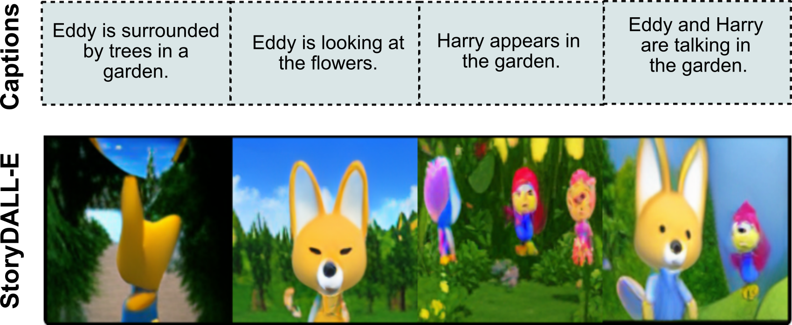

### Model Description

StoryDALL-E is a model trained for the task of Story Visualization \[1\]. The model receives a sequence of captions as input and generates a corresponding sequence of images which form a visual story depicting the narrative in the captions. It is based on the [mega-dalle](https://github.com/borisdayma/dalle-mini) model and is adapted from the corresponding [PyTorch codebase](https://github.com/kuprel/min-dalle). This model has been developed for academic purposes only.

\[[paper]()\]  \[[code]()\]

### Dataset

This model has been trained using the Pororo story visualization dataset \[1\]. The data was adapted from the popular cartoon series *Pororo the Little Penguin* and originally released by \[2\]. The Pororo dataset contains 9 recurring characters, as shown below, in the decreasing order of their frequency in the training data. Most of the scenes in the occur in a snowy village, surrounded by hills, trees and houses. A few episodes are located in gardens or water bodies. All the captions are in the English language and predominantly contain verbs in the present tense. Additionally, the training of this model starts from the pretrained checkpoint of mega-dalle, which is trained on the Conceptual Captions dataset.


### Intended Use
This model is intended for generating visual stories containing the 9 characters in the Pororo dataset. This version of the StoryDALL-E model is reasonable at the following scenarios:
* Frames containing a single character.
* Overtly visual actions such as *making cookies*, *walking*, *reading a book*, *sitting*.
* Scenes taking place in snowy settings, indoors and gardens.
* Visual stories contaning 1-3 characters across all frames.

Here are some examples of generated visual stories for the above-mentioned settings.



The model struggles to generate coherent images in the following scenarios.
* Multiple characters in a frame.
* Non-visual actions such as *compliment*.
* Characters that are infrequent in the training dataset e.g. Rody, Harry.
* Background locations that are not found in the cartoon.
* Completely new characters based on textual descriptions.

### Ethical Considerations.
Our experimental results are specific to the task of story visualization. By using cartoon images in our task, we avoid the egregious ethical issues associated with real-world usage of image generation such as DeepFakes. We focus not on generating realistic images, but on improved multi-modal understanding in the context of story visualization.

### Citation:
```
@inproceedings{maharana2022storydalle,
  title={Integrating Visuospatial, Linguistic and Commonsense Structure into Story Visualization},
  author={Maharana, Adyasha and Hannan, Darryl and Bansal, Mohit},
  booktitle={ECCV},
  year={2022}
}
```
Send questions or comments to adyasha@cs.unc.edu.


### References

\[1\] Li, Yitong, et al. "Storygan: A sequential conditional gan for story visualization." Proceedings of the IEEE/CVF Conference on Computer Vision and Pattern Recognition. 2019.

\[2\] Kim, Kyung-Min, et al. "DeepStory: video story QA by deep embedded memory networks." Proceedings of the 26th International Joint Conference on Artificial Intelligence. 2017.


