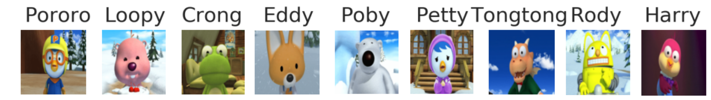
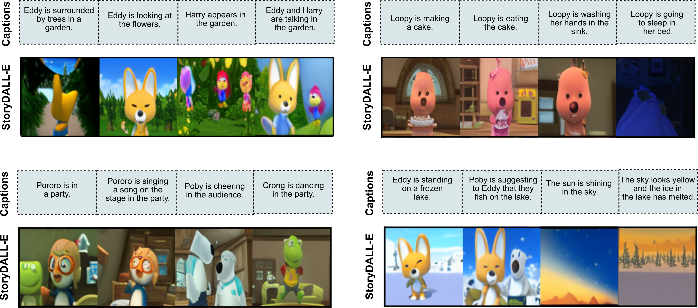

### Model Description

StoryDALL-E \[1\] is a model trained for the task of Story Visualization \[2\].
The model receives a sequence of captions as input and generates a corresponding sequence of images which form a visual story depicting the narrative in the captions. 
We modify this task to enable the model to receive an initial scene as input, which can be used as a cue for the setting of the story and also for generating unseen or low-resource visual elements. We refer to this task as Story Continuation \[1\].
StoryDALL-E is based on the [mega-dalle](https://github.com/borisdayma/dalle-mini) model and is adapted from the corresponding [PyTorch codebase](https://github.com/kuprel/min-dalle).
**This model has been developed for academic purposes only.**

\[[paper]()\]  \[[code]()\] \[[demo]()\]

### Dataset

This model has been trained using the Pororo story visualization dataset \[2\].
The data was adapted from the popular cartoon series *Pororo the Little Penguin* and originally released by \[3\].
The Pororo dataset contains 9 recurring characters, as shown below, in the decreasing order of their frequency in the training data.
<p align="center">
    
</p>
The training dataset contains nearly 10,000 samples in the training set. Most of the scenes occur in a snowy village, surrounded by hills, trees and houses. A few episodes are located in gardens or water bodies. All the captions are in the English language and predominantly contain verbs in the present tense.
<br>
Additionally, the training of this model starts from the pretrained checkpoint of mega-dalle, which is trained on 15 million images from the Conceptual Captions dataset \[4\] that has been scraped and filtered from billions of webpages.

### Intended Use
This model is intended for generating visual stories containing the 9 characters in the Pororo dataset. This version of the StoryDALL-E model is reasonable at the following scenarios:
* Frames containing a single character.
* Overtly visual actions such as *making cookies*, *walking*, *reading a book*, *sitting*.
* Scenes taking place in snowy settings, indoors and gardens.
* Visual stories contaning 1-3 characters across all frames.
* Scene transitions e.g. from day to night.

Here are some examples of generated visual stories for the above-mentioned settings.
<p align="center">
    
</p>
        
Due to the small training dataset size for story visualization, the model has poor generalization to some unseen settings. The model struggles to generate coherent images in the following scenarios.
* Multiple characters in a frame.
* Non-visual actions such as *compliment*.
* Characters that are infrequent in the training dataset e.g. *Rody*, *Harry*.
* Background locations that are not found in the cartoon e.g. *a busy city*.
* Color-based descriptions for object.
* Completely new characters based on textual descriptions.

In summary, we find that the model performs well at visualizing stories with up to three characters across all frames and struggles at generating coherent visuals for more than three characters. 
The model copies visual elements from the source image and copies to each of the generated frames in the story, hence maintaining a continuous flow in narration by virtue of conditioning on an initial scene. 
StoryDALL-E performs best at generating overtly visual actions and is capable of generating semantic concepts that do not appear in the story continuation dataset, such as *doughnut* and *lion*, by leveraging the pretrained knowledge of DALL-E Mega when possible. 
Most of the scenes in the Pororo dataset occur within the setting of a snowy village with wooden houses surrounded by trees and snow. Hence, the model usually generates scenes with similar visual elements.

### Ethical Considerations.
Our experimental results are specific to the task of story continuation. 
By using cartoon images in our task, we avoid the egregious ethical issues associated with real-world usage of image generation such as DeepFakes. 
We focus not on generating realistic images, but on improved multi-modal understanding in the context of story visualization.

### Citation:
```
@inproceedings{maharana2022storydalle,
  title={StoryDALL-E: Adapting Pretrained Text-to-Image Transformers for Story Continuation},
  author={Maharana, Adyasha and Hannan, Darryl and Bansal, Mohit},
  booktitle={ECCV},
  year={2022}
}
```
Send questions, feedback or comments to adyasha@cs.unc.edu.

### References

\[1\] Maharana, Adyasha, et al. "StoryDALL-E: Adapting Pretrained Text-to-Image Transformers for Story Continuation." ECCV. 2022.

\[2\] Li, Yitong, et al. "Storygan: A sequential conditional gan for story visualization." Proceedings of the IEEE/CVF Conference on Computer Vision and Pattern Recognition. 2019.

\[3\] Kim, Kyung-Min, et al. "DeepStory: video story QA by deep embedded memory networks." Proceedings of the 26th International Joint Conference on Artificial Intelligence. 2017.

\[4\] Sharma, Piyush, et al. "Conceptual captions: A cleaned, hypernymed, image alt-text dataset for automatic image captioning." Proceedings of the 56th Annual Meeting of the Association for Computational Linguistics (Volume 1: Long Papers). 2018.


