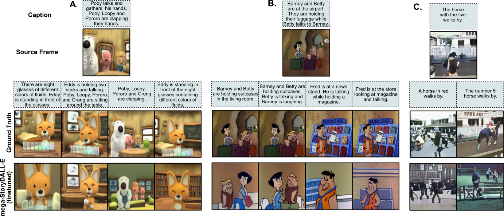
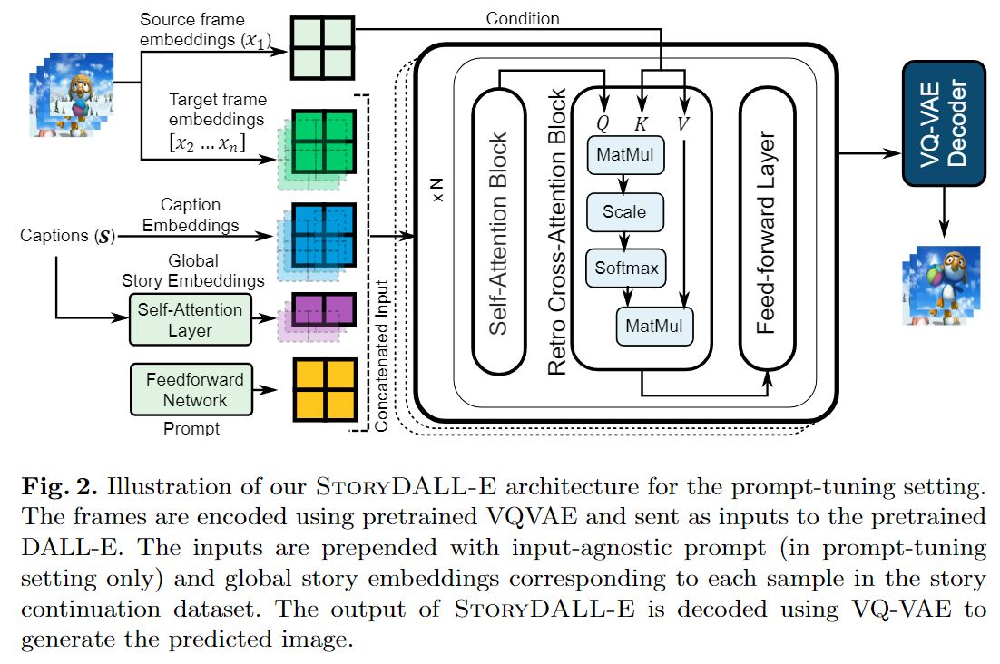

## StoryDALL-E: Adapting Pretrained Text-to-Image Transformers for Story Continuation

PyTorch code for the ECCV 2022 paper "StoryDALL-E: Adapting Pretrained Text-to-Image Transformers for Story Continuation".

\[[Paper](https://arxiv.org/abs/2209.06192)\] \[[Model Card](https://github.com/adymaharana/storydalle/blob/main/MODEL_CARD.MD)\] \[[Demo](https://github.com/adymaharana/storydalle/blob/main/DEMO.MD)\]





### Training

#### Prepare Repository:
Download the PororoSV dataset and associated files from [here](https://drive.google.com/file/d/1BqKizOZn4o4dbwNGK7ThCDnNEOVAolnf/view?usp=sharing) and save it as ```./data/pororo/```.<br>
Download the FlintstonesSV dataset and associated files from [here](https://drive.google.com/file/d/1kG4esNwabJQPWqadSDaugrlF4dRaV33_/view?usp=sharing) and save it as ```./data/flintstones```<br>
DiDeMoSV dataset is coming soon.

This repository contains separate folders for training StoryDALL-E based on [minDALL-E](https://github.com/kakaobrain/minDALL-E) and [DALL-E Mega](https://github.com/kuprel/min-dalle) models i.e. the ```./story_dalle/``` and ```./mega-story-dalle``` models respectively.

#### Training StoryDALL-E based on minDALL-E:

1. To finetune the minDALL-E model for story continuation, first migrate to the corresponding folder:\
```cd story-dalle```<br>
2. Set the environment variables in ```train_story.sh``` to point to the right locations in your system. Specifically, change the ```$DATA_DIR```, ```$OUT_DIR``` and ```$LOG_DIR``` if different from the default locations.
3. Download the pretrained checkpoint from [here](https://github.com/kakaobrain/minDALL-E)and save it in ```./1.3B```
4. Run the following command:
```bash train_story.sh <dataset_name>```

   
#### Training StoryDALL-E based on DALL-E Mega:

1. To finetune the minDALL-E model for story continuation, first migrate to the corresponding folder:\
```cd mega-story-dalle```<br>
2. Set the environment variables in ```train_story.sh``` to point to the right locations in your system. Specifically, change the ```$DATA_DIR```, ```$OUT_DIR``` and ```$LOG_DIR``` if different from the default locations.
3. Download the pretrained checkpoint from [here](https://github.com/kakaobrain/minDALL-E)and save it in ```./1.3B```
4. Run the following command:
```bash train_story.sh <dataset_name>```

